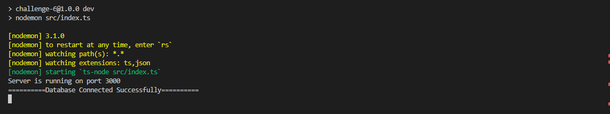
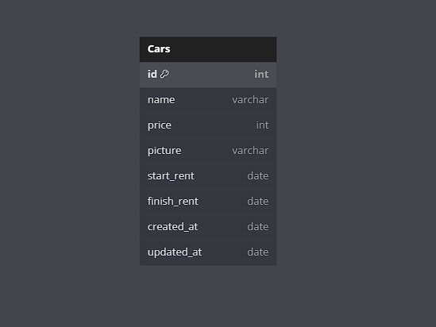

### SYNRGY 7 BINAR CHALLENGE 5 RESTFUL API FSW 2


### INSTRUCTION
1. Clone the project to your local machine.
2. Navigate to the project directory.
3. Run the command `npm install` to install dependencies.
4. Create a file named `.env` and copy all contents from `env.example` into it. 
   Then, replace the placeholder values with your own values for PostgreSQL and API Cloudinary.
5. Run the command `npm run migrate:latest` to confirm table creation via migration. 
   If you want to create a new table, run `npm run migrate:make tableName`.
6. Populate the tables with data by running `npm run seed:run`.
7. If you have TypeScript files, compile them into JavaScript using `npx tsc`.
8. Finally, start the server by running `npm run dev`.
9. Ensure that your database is connected to the project as shown in the image below:



10. Enjoy using the application!


# API Documentation

This documentation provides details on how to interact with the Cars API.

## Base URL

The base URL for all requests is `http://localhost:3000/api/cars`.

## Endpoints

### Show All Data Cars

- **Request**
  - Endpoint: `/api/cars`
  - Method: `GET`

- **cURL Request**
    ```
    bash
    curl -i --location 'http://localhost:3000/api/cars'
    ```

- **cURL Response**
    ```
    bash
    HTTP/1.1 200 OK
    X-Powered-By: Express
    Content-Type: application/json; charset=utf-8
    Content-Length: 930
    ETag: W/"3a2-/j7zplGknqg50zRwGQGGmg/O00k"
    Date: Mon, 20 May 2024 09:05:56 GMT
    Connection: keep-alive
    Keep-Alive: timeout=5

    [{"id":1,"name":"Honda Camry","price":50000000,"picture":"https://res.cloudinary.com/dfylrgzcu/image/upload/v1715849971/fsw/i9w2bvzhkv3n5h7suew3.jpg","start_rent":"2024-05-30T05:14:00.000Z","finish_rent":"2024-06-20T05:14:00.000Z","created_at":"2024-05-15T08:47:25.000Z","updated_at":"2024-05-16T01:59:28.000Z"},{"id":2,"name":"Honda Camry","price":50000000,"picture":"https://res.cloudinary.com/dfylrgzcu/image/upload/v1715849971/fsw/i9w2bvzhkv3n5h7suew3.jpg","start_rent":"2024-05-30T05:14:00.000Z","finish_rent":"2024-06-20T05:14:00.000Z","created_at":"2024-05-15T08:47:25.000Z","updated_at":"2024-05-16T01:59:28.000Z"},{"id":4,"name":"Mobil 1","price":700000000,"picture":"http://res.cloudinary.com/ddjqfgbmr/image/upload/v1716192219/bcr/zl1o0q4orpwxrfpnk7yn.png","start_rent":"2024-05-30T05:14:00.000Z","finish_rent":"2024-05-30T05:14:00.000Z","created_at":"2024-05-20T07:33:56.822Z","updated_at":"2024-05-20T08:03:40.542Z"}]
    ```

### Show Data By Id

- **Request**
  - Endpoint: `/api/cars/:id`
  - Method: `GET`

- **cURL Request**
    ```
    bash
    curl -i --location 'http://localhost:3000/api/cars/1'
    ```

- **cURL Response**
    ```
    bash
    HTTP/1.1 200 OK
    X-Powered-By: Express
    Content-Type: application/json; charset=utf-8
    Content-Length: 310
    ETag: W/"136-QrulJEnIQ42Fydi8OyNLWS1ZfVI"
    Date: Mon, 20 May 2024 09:07:47 GMT
    Connection: keep-alive
    Keep-Alive: timeout=5

    {"id":1,"name":"Honda Camry","price":50000000,"picture":"https://res.cloudinary.com/dfylrgzcu/image/upload/v1715849971/fsw/i9w2bvzhkv3n5h7suew3.jpg","start_rent":"2024-05-30T05:14:00.000Z","finish_rent":"2024-06-20T05:14:00.000Z","created_at":"2024-05-15T08:47:25.000Z","updated_at":"2024-05-16T01:59:28.000Z"}
    ```

### Create Data Car

- **Request**
  - Endpoint: `/api/cars`
  - Method: `POST`

- **cURL Request**
    ```
    bash
    curl --location 'localhost:3000/api/cars' \
    --form 'name="Lamborgini"' \
    --form 'price="700000000"' \
    --form 'picture=@"/D:/Download/budi.PNG"' \
    --form 'start_rent="2024-05-30 12:14:00"' \
    --form 'finish_rent="2024-05-30 12:14:00"'
    ```

- **cURL Response**
    ```
    bash
    {"message":"Car created successfully","car":{"name":"Mobil Budi","price":700000000,"picture":"http://res.cloudinary.com/ddjqfgbmr/image/upload/v1716196378/bcr/pyf6slysvf7zzdpafvxk.png","start_rent":"2024-05-30T05:14:00.000Z","finish_rent":"2024-05-30T05:14:00.000Z","created_at":"2024-05-20T09:12:58.633Z","updated_at":"2024-05-20T09:12:58.633Z","id":5}}
    ```

### Update Data Car

- **Request**
  - Endpoint: `/api/cars`
  - Method: `PUT`

- **cURL Request**
    ```
    bash
    curl --location --request PUT 'localhost:3000/api/cars/4' \
    --form 'name="Lamborgini"' \
    --form 'price="700000000"' \
    --form 'picture=@"/D:/Download/budi.PNG"' \
    --form 'start_rent="2024-05-30 12:14:00"' \
    --form 'finish_rent="2024-05-30 12:14:00"'
    ```

- **cURL Response**
    ```
    bash
    {"message":"Car updated successfully","car":{"id":4,"name":"Lamborgini","price":700000000,"picture":"http://res.cloudinary.com/ddjqfgbmr/image/upload/v1716196789/bcr/zh8isqp6o3yg6u2jktoe.png","start_rent":"2024-05-30T05:14:00.000Z","finish_rent":"2024-05-30T05:14:00.000Z","created_at":"2024-05-20T07:33:56.822Z","updated_at":"2024-05-20T09:19:49.780Z"}}
    ```

### Delete Data Car

- **Request**
  - Endpoint: `/api/cars/:id`
  - Method: `DELETE`

- **cURL Request**
    ```
    bash
    curl --location --request DELETE 'localhost:3000/api/cars/3'
    ```

- **cURL Response**
    ```
    bash
    {"message":"Car deleted successfully"}
    ```




